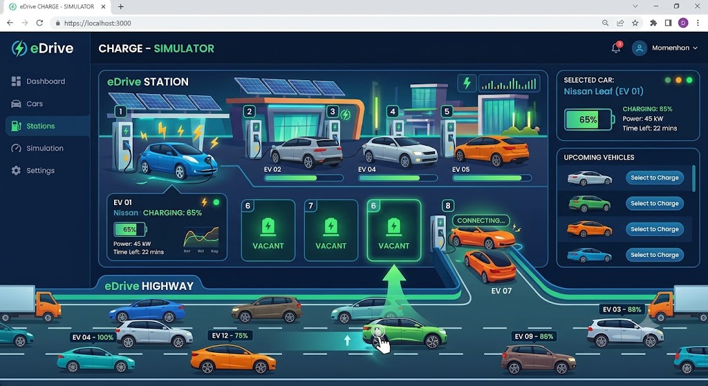

## Overview

This repository contains an EV charging station simulation assignment template.

The target application is a visually rich, modern web page where:

* Cars continuously move on a roadway at the bottom of the screen.
* Cars are generated at regular intervals and move slowly across the roadway.
* A user can click a moving car to send it to an available charging slot.
* The selected car charges over about one minute while battery progress is shown live.
* The car exits the station and returns to roadway traffic when charging completes.
* A cumulative metric displays total energy dispensed across all completed sessions.

## MVP Tab Scope

The initial MVP should focus only on the Dashboard tab.

* Dashboard tab: full charging station simulation experience
* Cars tab: functional placeholder text only
* Stations tab: functional placeholder text only
* Simulation tab: functional placeholder text only
* Settings tab: functional placeholder text only

Placeholder tabs should render clear messaging that the content will be implemented in future stages.

## Product Direction

Primary product requirements are documented in [docs/prd-vehicle-charging.md](docs/prd-vehicle-charging.md).

Use this visual reference as the target interaction style and atmosphere:



## Repository Layout

```text
├── README.md
└── docs/
        ├── images/
        ├── install-squad.md
        └── prd-vehicle-charging.md
```

## Next Implementation Scope

Initial build focus should include:

* Roadway animation engine for continuously moving traffic
* Regular car generation and controlled slow roadway movement
* Click-to-charge interaction and slot assignment behavior
* Charging lifecycle state machine (enter, charge, exit, rejoin)
* Live battery progress visualization for each active charging session
* Cumulative total energy dispensed counter
* Responsive modern UI for desktop and mobile

## Contributing

* Keep PRDs in docs/ using the pattern prd-*.md.
* Keep visual references under docs/images/.
* Follow repository Copilot and coding instructions when adding source code and infrastructure artifacts.
